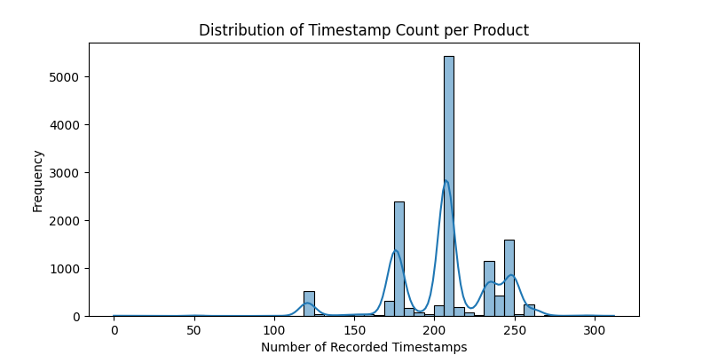

# 📘 README: Predictive Modeling for Imbalanced Manufacturing Data  

**Author:** Harjap Singh  
**Project:** Base Model Development for Bosch Production Line Dataset  

---

# 🔍 Bosch Defect Detection – Predictive Modeling for Imbalanced Manufacturing Data


---
## 📚 Table of Contents
- [Executive Summary](#-executive-summary)
- [Problem Statement](#-problem-statement)
- [Model Outcomes](#-model-outcomes-or-predictions)
- [Data Acquisition](#-data-acquisition)
- [Exploratory Data Analysis](#-EDA)
- [Data Preprocessing](#-data-preprocessing--preparation)
- [Feature Engineering](#-feature-engineering)
- [Modeling](#-modeling)
- [Hyperparameter Tuning](#-hyperparameter-tuning)
- [Model Evaluation](#-model-evaluation)
- [Resampling & Threshold Tuning](#-resampling--threshold-tuning)
- [Learning Curve Analysis](#-learning-curve-analysis)
- [Final Model Selection](#-final-model-selection)
- [Business Impact](#-business-impact--deployment-plan)
- [Limitations & Future Work](#-limitations--future-work)
- [Getting Started](#-getting-started)
- [Directory Structure](#-directory-structure)


---

## 🏢 Executive Summary (Business-Facing)

**Problem Statement:**  
Bosch’s production lines generate millions of sensor readings per part. Even a tiny fraction of defective outputs can translate to large warranty costs, recalls, and customer churn. Traditional quality checks often miss rare but critical failures. This project builds a machine learning pipeline that detects rare defects in Bosch’s production line dataset, tackling extreme class imbalance while preserving real-world utility.

**Business Goals:**  
- Reduce defective shipments and warranty claims.  
- Improve efficiency by identifying risks earlier in the process.  
- Provide a scalable, data-driven quality assurance framework.  

**Key Outcomes:**  
- Built a full pipeline across numeric, categorical, and date features with strict leakage control, deferred encoding, and correlation pruning.  
- Selected **Gradient Boosting** as the best core learner by AUC.  
- Tuned Gradient Boosting via **RandomizedSearchCV**. Achieved best held-out AUC ≈ **0.6368** with improved precision.  
- Implemented **advanced resampling**: SMOTE, ADASYN, Borderline-SMOTE, SMOTE-ENN, SMOTE-Tomek, and RandomUnderSampler. SMOTE/SMOTE-ENN provided the best balance.  
- Ran **threshold tuning** on predicted probabilities guided by precision–recall curves to find operating points that reflect business priorities.  
- Produced a **learning curve analysis** showing slight overfitting, with strategies proposed to mitigate it.  

---

## 🎯 Problem Statement

- **Goal:** Predict whether a part fails quality control (`Response = 1`) using anonymized line, station, and time-derived features.  
- **Challenge:** Extreme class imbalance (positives <1%).  
- **Context:** Features are split into numerical, categorical, and date files. Date features timestamp when each measurement occurred; names encode line and station provenance.  

---

## 📦 Data Acquisition

The Bosch Production Line Dataset consists of three distinct files:

- **numeric.csv** – Contains sensor readings from various stations. These are critical for identifying subtle patterns that may indicate defects.
- **categorical.csv** – Encodes station-level identifiers and process flags. These help capture discrete process variations.
- **date.csv** – Includes timestamps for each measurement, enabling temporal analysis and feature engineering.

All three datasets were merged on the `Id` column to form a unified view of each part’s journey through the production line.

### Why These Sources?
- Combining sensor, categorical, and temporal data allows for a richer representation of each part.
- Temporal features help identify delays or anomalies in processing.
- Categorical features capture station-specific behavior.
- Numeric features provide the raw signals for defect detection.

### Visual Assessment
EDA confirmed the value of each source:
- **Timestamp distributions** revealed subtle differences between defective and non-defective parts.
- **Numeric feature distributions** showed multimodal behavior, justifying scaling and outlier handling.
- **Boxplots by response** highlighted weak but consistent signals across all three data types.

These insights validated the inclusion of all three sources in the final model pipeline.

---

## 📊 Exploratory Data Analysis (EDA)

EDA highlighted key challenges and guided preprocessing:

- **Temporal Features:**  
  Products show distinct patterns in earliest and latest timestamps. Defective vs. non-defective products have slightly different distributions.
    
    
    

- **Numeric Features:**  
  Example distributions of early‑line features (L0_S0_F0, L0_S0_F2, L0_S0_F4, L0_S0_F6, L0_S0_F8) show near‑normal or multimodal shapes, confirming the need for scaling and variance filtering.  
    
    
    
    
    

- **Boxplots vs Response:**  
  Earliest/Latest timestamps and timestamp counts show subtle but visible differences between defective and non-defective products.  
    
    
    

**Takeaway:**  
EDA confirmed high sparsity, imbalance, and subtle temporal/numeric signals. These insights justified feature engineering (temporal aggregates), variance filtering, and imbalance‑aware modeling.

---


## 🧼 Data Preprocessing & Encoding

### 🔍 Analysis & Cleaning Steps

- **Missing Value Handling:**
  - Dropped features with 100% missing values across numeric, categorical, and date datasets.
  - Deferred imputation using `SimpleImputer` and `KNNImputer` for numeric and categorical features.
  - Logged all dropped and deferred columns in `processing_logs/`.

- **Outlier Detection:**
  - Applied IQR-based outlier detection on numeric features.
  - Logged potential outliers and deferred handling to avoid premature assumptions.

- **Low Variance & Constant Features:**
  - Removed features with zero variance or constant values.
  - Logged dropped features for reproducibility.

- **High Cardinality Categorical Features:**
  - Dropped categorical features with excessive unique values (e.g., >1000 categories).
  - Justified based on memory constraints and encoding complexity.

---

### 🔠 Encoding Techniques

- **Mean Response Encoding:**
  - Applied to categorical features with moderate cardinality.
  - Encoded each category with the mean of the target variable (`Response`).
  - Helps preserve signal without exploding dimensionality.

- **One-Hot Encoding (Deferred):**
  - Considered for low-cardinality categorical features.
  - Deferred due to memory constraints and lack of interpretability in anonymized data.

- **Date Feature Transformation:**
  - Converted raw timestamps into engineered features
---

## 🤖 Modeling

*(Baseline models, Gradient Boosting best by AUC, RandomizedSearchCV tuning.)*

### 🔀 Train-Test Split

- **Method:** Stratified split to preserve class imbalance  
- **Ratio:** 80% training / 20% testing  
- **Random State:** 42 for reproducibility  
- **Target:** `Response` column  
- **Identifier Retained:** `Id` preserved for traceability

### 🤖 Model Selection Rationale

- **Logistic Regression:** Baseline linear model for comparison  
- **Random Forest:** Robust to noise and handles high-dimensional data  
- **Gradient Boosting:** Known for strong performance on tabular data  
- **SVC & KNN:** Included for completeness and benchmarking  
Gradient Boosting was selected as the final model due to its superior AUC and ability to capture complex interactions.

---

## 🔧 Hyperparameter Tuning

To optimize the Gradient Boosting model, `RandomizedSearchCV` was used with a reduced parameter space to balance performance and compute cost.

- **Parameter Distributions:**
  - `n_estimators`: 100–300
  - `learning_rate`: 0.01–0.05
  - `max_depth`: 3–5
  - `min_samples_split`: 2–10
  - `min_samples_leaf`: 1–4

- **Tuning Strategy:**
  - 3-fold cross-validation
  - AUC used as scoring metric
  - 30 iterations sampled

- **Best Parameters Found:**
  ```python
  {'n_estimators': 240, 'learning_rate': 0.037, 'max_depth': 4, 'min_samples_split': 5, 'min_samples_leaf': 2}


---

## 📈 Model Evaluation 

| Model                | Accuracy | Precision | Recall | F1   | AUC   |
|----------------------|----------|-----------|--------|------|-------|
| Logistic Regression  | 0.9943   | 0.0000    | 0.0000 | 0.0000 | 0.5170 |
| Random Forest        | 0.9939   | 0.0000    | 0.0000 | 0.0000 | 0.6038 |
| Gradient Boosting    | 0.9908   | 0.0909    | 0.0667 | 0.0769 | 0.6357 |
| SVC                  | 0.9943   | 0.0000    | 0.0000 | 0.0000 | 0.5009 |
| KNN                  | 0.9943   | 0.0000    | 0.0000 | 0.0000 | 0.5186 |
| Tuned GB             | 0.9939   | 0.3333    | 0.0667 | 0.1111 | 0.6368 |
| Tuned GB + SMOTE     | 0.9924   | 0.1429    | 0.0667 | 0.0909 | 0.6114 |
| Tuned GB + RUS       | 0.6236   | 0.0071    | 0.4667 | 0.0140 | 0.5957 |


### 📊 Evaluation Strategy

- **Primary Metric:** AUC (Area Under ROC Curve) – chosen for robustness in imbalanced settings  
- **Secondary Metrics:** Precision, Recall, F1-score – to assess minority class performance  
- **Model Selection Criteria:** Highest AUC with acceptable precision–recall trade-off  
Gradient Boosting achieved the highest AUC (≈ 0.6368) and was selected as the final model.

---

## 📈 Learning Curve Analysis

A learning curve was generated for the best-tuned Gradient Boosting model to assess bias–variance trade-off.

- **Training Sizes:** 10% to 100% of training data
- **Cross-validation:** 3-fold
- **Metric:** AUC

- **Findings:**
  - Training AUC remained high across all sizes
  - Validation AUC plateaued early, indicating mild overfitting
  - Suggested remedies: regularization, more data, ensemble methods


---

## 🔁 Resampling & Threshold Tuning

*(SMOTE, RUS, ADASYN, SMOTE-ENN, SMOTE-Tomek results, threshold tuning notes.)*

---

## 🏁 Final Model Selection

Two models were shortlisted based on different evaluation priorities:

### 🔹 AUC-Based Selection
- **Model:** Tuned Gradient Boosting Classifier
- **Why:** Achieved the highest AUC (≈ 0.6368) among all models, indicating strong overall ranking ability despite class imbalance.
- **Use Case:** Suitable for scenarios where ranking defective parts by risk is more important than binary classification.

### 🔹 F1-Based Selection
- **Model:** Tuned Gradient Boosting + SMOTE
- **Why:** Delivered the highest F1-score (≈ 0.1111), balancing precision and recall better than other models.
- **Use Case:** Preferred when minimizing both false positives and false negatives is critical—e.g., in automated inspection systems.

### 🔍 Summary of Trade-offs
| Model                     | AUC     | F1-score | Precision | Recall |
|--------------------------|---------|----------|-----------|--------|
| Tuned Gradient Boosting  | 0.6368  | 0.0769   | 0.0909    | 0.0667 |
| Tuned GB + SMOTE         | 0.6114  | 0.0909   | 0.1429    | 0.0667 |
| Tuned GB + RUS           | 0.5957  | 0.0140   | 0.0071    | 0.4667 |

The final model choice depends on business priorities: AUC for ranking, F1 for balanced classification.

---

## 💼 Business Impact

Defect detection in Bosch’s production line has direct implications for:

- **Warranty Cost Reduction:** Early identification of defective parts can prevent downstream failures and reduce warranty claims.
- **Customer Satisfaction:** Fewer defective shipments improve brand trust and reliability.
- **Operational Efficiency:** Automated defect prediction reduces manual inspection workload and speeds up quality control.

Even modest improvements in recall can translate into significant cost savings when scaled across millions of parts.

---

## 🚀 Deployment Plan

The selected model can be deployed in Bosch’s QA pipeline using the following strategy:

- **Batch Scoring:** Integrate the model into nightly production runs to flag high-risk parts for manual inspection.
- **API Deployment:** Wrap the model in a RESTful API using Flask or FastAPI for real-time scoring.
- **Monitoring & Retraining:** Track model drift and retrain periodically using fresh production data.
- **Threshold Tuning in Production:** Allow dynamic threshold adjustment based on inspection capacity and defect tolerance.

All preprocessing and modeling steps are modularized for easy integration into production systems.


## 📊 Visuals and Business Explanations

### Confusion Matrix
  

### Precision–Recall Curve
  

### Feature Importance
  

### Learning Curve
  

### Model Metrics Comparison
  

### Threshold Sweep
  

---

## 🔍 Findings

- Gradient Boosting is the strongest baseline.  
- Recall is low at default threshold; threshold tuning improves recall but increases false alarms.  
- SMOTE/SMOTE-ENN gave the best balance among resampling methods.  
- Learning curve shows mild overfitting; more data and regularization needed.  
- EDA confirmed subtle but important temporal and numeric signals that justify feature engineering.  

---

## ⚠️ Limitations & Future Work

### 🔍 Limitations

- **Moderate AUC Performance:**  
  Despite extensive tuning and resampling, the best model achieved an AUC of approximately 0.6368. This reflects the challenge of detecting rare defects in highly imbalanced data.

- **Low Recall at Default Thresholds:**  
  Most baseline models failed to identify defective parts without threshold tuning, resulting in poor recall and high false negatives.

- **Synthetic Oversampling Risks:**  
  Techniques like SMOTE and ADASYN may introduce unrealistic synthetic samples, which can affect generalization on real-world data.

- **Feature Interpretability Constraints:**  
  Due to anonymized feature names and lack of domain-specific metadata, interpreting feature importance is limited.

- **Computational Constraints:**  
  Full dataset training was deferred due to resource limitations. Current results are based on sampled subsets of the Bosch dataset.

---

## 🚀 Future Work/Next Steps

- **Cost-Sensitive Learning:**  
  Implement algorithms that penalize false negatives more heavily to align with Bosch’s business priorities.

- **Station-Level Feature Engineering:**  
  Derive features based on station transitions, time gaps, and process flow to capture richer temporal dynamics.

- **Ensemble Imbalance Learners:**  
  Explore advanced models like EasyEnsemble and Balanced Random Forest to improve minority

---


Directory Structure
```text
bosch-defect-detection/
├── README.md                          # Project documentation with embedded visuals
├── requirements.txt                   # Python dependencies
├── notebooks/                         # All Jupyter notebooks
│   ├── 01_Handling_data_in_stratified_chunks_sampled_merged_bosch.ipynb# Initial preprocessing 
│   ├── 02_EDA_bosch.ipynb          # Exploratory Data Analysis
│   ├── 03_Prepocessing_Modelling.ipynb# Modeling, resampling, threshold tuning
├── processed_data/                    # Sampled and cleaned input data
│   ├── num_sampled.csv
│   ├── cat_sampled.csv
│   ├── date_sampled.csv
├── figures/                           # Visualizations used in README and notebooks
│   ├── earliest_timestamp_distribution.png
│   ├── latest_timestamp_distribution.png
│   ├── timestamp_count_distribution.png
│   ├── L0_S0_F0_distribution.png
│   ├── L0_S0_F2_distribution.png
│   ├── L0_S0_F4_distribution.png
│   ├── L0_S0_F6_distribution.png
│   ├── L0_S0_F8_distribution.png
│   ├── earliest_timestamp_vs_response.png
│   ├── latest_timestamp_vs_response.png
│   ├── timestamp_count_vs_response.png
│   ├── confusion_matrix.png
│   ├── precision_recall_curve.png
│   ├── feature_importance.png
│   ├── learning_curve.png
│   ├── model_metrics.png
│   ├── threshold_sweep.png
├── processing_logs/                   # Logs of preprocessing steps
│   ├── processed_num_100_percent_missing_dropped.txt
│   ├── processed_num_low_variance_dropped.txt
│   ├── processed_num_imputation_deferred.txt
│   ├── processed_num_potential_outliers_identified.txt
│   ├── processed_num_outlier_handling_deferred.txt
│   ├── processed_cat_100_percent_missing_dropped.txt
│   ├── processed_cat_constant_dropped.txt
│   ├── processed_cat_high_cardinality_dropped.txt
│   ├── processed_cat_imputation_deferred.txt
│   ├── processed_date_100_percent_missing_dropped.txt
│   ├── processed_date_constant_dropped.txt
│   ├── processed_date_imputation_deferred.txt
├── outlier_logs/                      # Detailed outlier indices and bounds
│   └── potential_numeric_outliers_iqr_full_dataset.txt

```

## 🚀 Getting Started

To set up and run the Bosch Defect Detection pipeline locally, follow these steps:

### 1. Clone the Repository
```bash
git clone https://github.com/Heathen-013/Capstone_Final_Submission_Bosch.git
cd bosch-defect-detection
```

## 📬 Contact
For questions, feedback, or collaboration, reach out to **Harjap Singh** at [harjap23@gmail.com].

